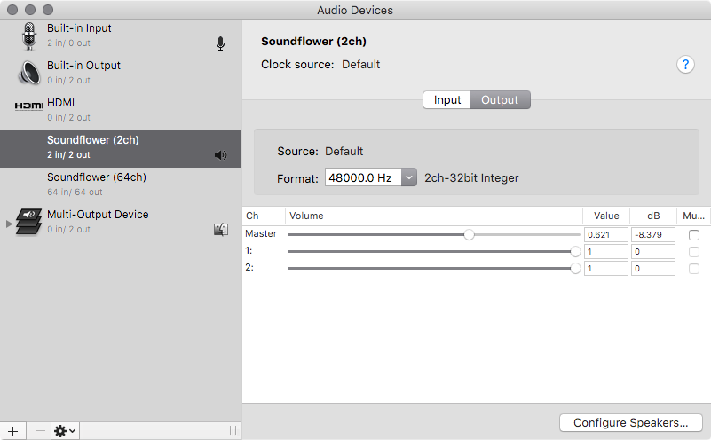

### Install Soundflower

- [Soundflower 2.0b2](Soundflower-2.0b2.dmg)
- [Soundflower 1.6.6b](Soundflower-1.6.6b.dmg)

##### Passo 1 - Audio MIDI Setup

##### Passo 2 - Audio MIDI Setup

#####  Passo 3 - Audio MIDI Setup

##### Passo 4 - Audio MIDI Setup

##### Passo 5 - Audio MIDI Setup

##### Passo 6 - Sound

##### Passo 7 - Soundflower

